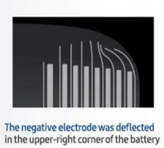
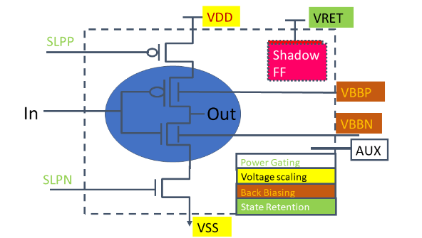
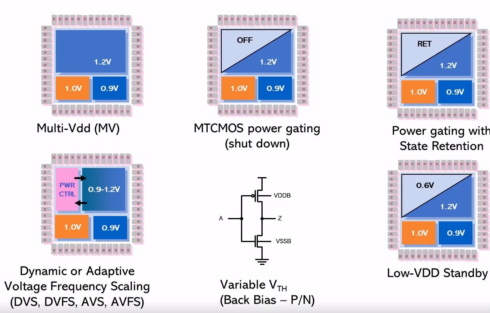
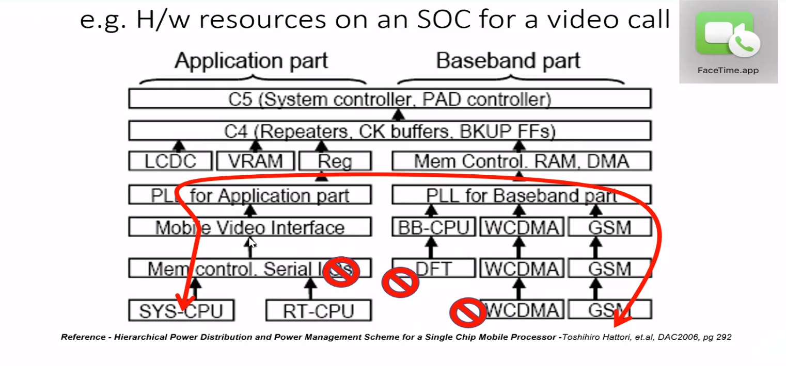
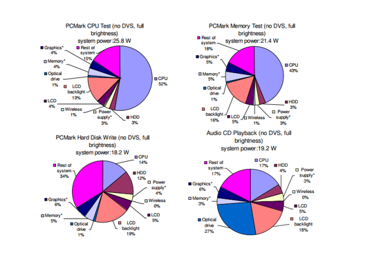
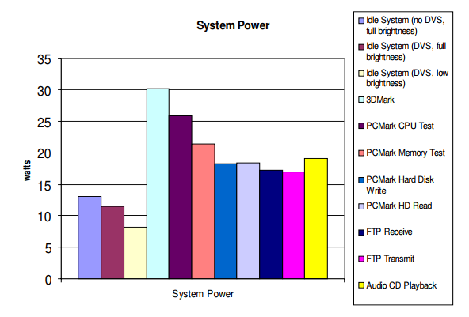
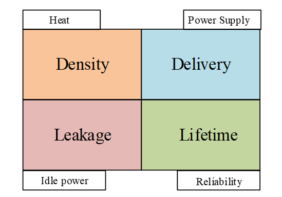

# VSD Low power Design using Sky130nm PDK Workshop

Table of contents
=================
<!--ts-->
   * [Day 1](https://github.com/manjunathrv/VSD_Low_power_Design_using_Sky130nm_PDK#day-1)
      * [Introduction to Low Power Design](https://github.com/manjunathrv/VSD_Low_power_Design_using_Sky130nm_PDK#introduction-to-low-power-design)
      * [Background](https://github.com/manjunathrv/VSD_Low_power_Design_using_Sky130nm_PDK#background)
      
   * [Day 2](https://github.com/manjunathrv/VSD_Low_power_Design_using_Sky130nm_PDK#day-2)
      * [Low Power fundamentals](https://github.com/manjunathrv/VSD_Low_power_Design_using_Sky130nm_PDK#low-power-fundamentals)
      * [Voltage Control techniques](https://github.com/manjunathrv/VSD_Low_power_Design_using_Sky130nm_PDK#voltage-control-techniques-1)
   
<!---   * [Day 3](https://github.com/manjunathrv/VSD_Advanced_Physical_Design_with_sky130nmPDK#day-3)
      * [IO placement modification](https://github.com/manjunathrv/VSD_Advanced_Physical_Design_with_sky130nmPDK#vsd-cmos-inverter-cell)
      * [VSD CMOS Inverter Cell](https://github.com/manjunathrv/VSD_Advanced_Physical_Design_with_sky130nmPDK#vsd-cmos-inverter-cell)
      * [Spice simulation of the VSD CMOS Inverter Cell](https://github.com/manjunathrv/VSD_Advanced_Physical_Design_with_sky130nmPDK#spice-simulation-of-the-vsd-cmos-inverter-cell)
   	
   * [Day 4](https://github.com/manjunathrv/VSD_Advanced_Physical_Design_with_sky130nmPDK#day-4)
      * [Extracting LEF file from the VSD Standard inverter cell](https://github.com/manjunathrv/VSD_Advanced_Physical_Design_with_sky130nmPDK#extracting-lef-file-from-the-vsd-standard-inverter-cell)
      * [Floorplan with VSD Standard inverter cell](https://github.com/manjunathrv/VSD_Advanced_Physical_Design_with_sky130nmPDK#floorplan-with-vsd-standard-inverter-cell)
      * [Timing analysis using OPENSTA](https://github.com/manjunathrv/VSD_Advanced_Physical_Design_with_sky130nmPDK#timing-analysis-using-opensta)
      * [Clock Tree synthesis](https://github.com/manjunathrv/VSD_Advanced_Physical_Design_with_sky130nmPDK#clock-tree-synthesis)
 
   * [Day 5](https://github.com/manjunathrv/VSD_Advanced_Physical_Design_with_sky130nmPDK#day-5)
      * [Placement](https://github.com/manjunathrv/VSD_Advanced_Physical_Design_with_sky130nmPDK#placement)
      * [Routing](https://github.com/manjunathrv/VSD_Advanced_Physical_Design_with_sky130nmPDK#routing)
      * [GDS II generation](https://github.com/manjunathrv/VSD_Advanced_Physical_Design_with_sky130nmPDK#gds-ii-generation)
  
   * [Workshop Learning Outcomes](https://github.com/manjunathrv/VSD_Advanced_Physical_Design_with_sky130nmPDK#workshop-learning-outcomes)

   * [Acknowledgement](https://github.com/manjunathrv/VSD_Advanced_Physical_Design_with_sky130nmPDK#acknowledgements)---|>

<!--te-->

# Day 1 

## Introduction to Low power Design
### Definitions 

| Power                          | Energy                |
|--------------------------------|-----------------------|
| Instantaneous draw - V* I                                  | Total power draw over time   |
| Requirement -  deliver I at V and $\Delta$I at V          | Depends on the available capacity of the power source  |
| Heat generated | Form factor and size of the battery  |

### Impact 
| Increasing Power Consumption   | Increasing Energy Consumption  |
|--------------------------------|-----------------------|
| Heat generated in the IC/system increases | Finite packed resource depletes faster |
| Requirement of better heat sink/fan       | Cost increases with energy consumption  |
| Frequency gets capped resulting in decrease in performance | Systemic Metric  |
| Material degradation ||

### Economics of Power/Energy 
The power and energy consumption in an IC or a system impacts the complete economics of the product. The factors affected are mentioned below, 
1. Performance
2. Cost 
3. Weight
4. Form factor
5. Overall functionality
6. Safety 
7. Usage of the system (Portable or mobile)

### Power vs Perfomance 
In the below example, a case study is done to know if the improvement of performance can lead to increase or decrease in power consumption.  
Consider a a display monitor having 1920x1080 (~2M pixels) processed at 120Hz/60Hz  
Case 1 - Consider a 1.8V processor at 120Hz, 240Mhz   
The power consumption = 1.8^2 * 240 = 3.24 W  
Case 2 - Consider a  1.2V processor at 60Hz, 120Mhz   
The power consumption = 1.2^2 * 120Mhz = 1.44W 
Improving the performance does leads to higher power consumption. 

### Comparison between systems - Portable, Mobile and Mobility  
| Portable                          | Mobile                | Mobility |
|--------------------------------|-----------------------|----------------|
| Needs electricity and could run on battery | Runs on battery | change in service and uses cases in a mobile |
| Ex Laptop     | Eg Smartphone, Tablet | Phone with 4G/5G services|
                           

### Assignment 
1. Case study 1 - Galaxy note explosion issue  
Some of the main reasons are due to bad design of battery electrodes and insufficent insulation in packaging. https://www.bbc.com/news/business-38714461  
The below image shows that the negative electrodes in the battery was deflected in the upper right corner due to insufficient space leading to shorting of the electrodes.   
   

2. Case study 2 - CPU Fan specifications 
An CPU fan used for cooling the processor and its specification is described in the image below,  
   

The specification describe the following 
1. Operating voltage of the device - 12V 
2. The maximum wattage of the CPU to which the Fan can be mounted.
3. Thermal resistance of the device. A lower thermal resistance indicate that device offers less resistance to heat flow and has the ability to cool CPU faster. 

3. Case study 3 - Apple iphone 6 battery issues  
The main reason stated by apple for slowing down the performance of iphone 6 was to compensate the degration and lifetime of battery.  https://www.theverge.com/2017/12/28/16827248/apple-iphone-battery-replacement-price-slow-down-apology

## Background
Basic concepts are refreshed 

| Parameter   | Definition                |
|--------------------------------|-----------------------|
| Voltage | Measure of the electric field or force  |
| Current | Rate of flow of charges under an electric field |
|R,L and C | That impedes the current or changes the state of Voltage |

### CMOS operational regions 
   

The different operating conditions in a CMOS combinational and sequential circuit based on the rise and fall time are mentioned below, 

| Parameter   | Combinational Logic | Sequential Logic |
|--------------------------------|-----------------------|----------|
| Shutdown | OFF | OFF |
| Standby  | ON  | Reads are allowed no writes |
| Active  | ON | Read and write are allowed |

### 7 degrees of Voltage Control in a CMOS device
The below figure is an example of a CMOS inverter with Voltage nodes that can be used for a low power design 

   

| Name   | Voltage Nodes |
|--------|---------|
| Power gating  | SLPP, SLPN |
| Voltage scaling  | VDD,VSS |
| Back Biasing  | VBBP,VBBN | 
| State Retention | VRET|

### Voltage control techniques
The various techniques for voltage control in a CMOS IC design are descirbed in the below figure ,

   

 

| Name   | Description |
|--------------------------------|-----------------------|
| Multi Vdd (MVV)  | Divide the blocks into static multiple voltages |
| MTCMOS power gating  | Shut down logic not in use by placing a switch (power gating transistor) |
| Power gating with state retention  | Variant of power gating that to retain the state | 
| Dynamic or adaptive Voltage frequency scaling (DVS, DVFS, AVS, AVFS) | VRET|
| Variable Vth | Done by Back bias of PMOS/NMOS (for memory)|
| Low VDD standby | Blocks not in use reduce the voltage to retain the state|

### Multi-voltage control techniques in some applications 
Some of the multi-voltage control techniques used in various applications are listed below,  

| Application   | Concerns  | Mult-Voltage control techniques | 
|---------|------------|------------|
| Audio  | Battery life | Power Gating |
| Video  | Active, Idle | DVFS, Standby, Power Gating |
| GPS  | Response, Battery life |  Power Gating |
| W/S. Server | Perfomance, Heat | DVFS, Multi-VDD |
| Laptop | Heat, port density | DVFS,standby, Power gating |
| Networking| Heat, port density| Multi-VDD, Standby, Power gating  |
| USB| Peak Power | Multi-VDD  |

# Day 2

## Low Power fundamentals
### Definitions 
The total power dissipations in a CMOS is mainly divided into static power dissipation and dynamic power dissipation given by the below equations,   
  
   

The static power dissipation is the first part of the sum and the dynamic power is defined by the second part of the sum.   
 

### Power distribution during an operation in an SOC mobile processor
During operation of an application in a mobile phone for ex, various activities are invoked to utilise the hardware resources to perform the function.  
An example of hardware resources used during a video-call applicaiton in a Mobile processor is shown below, 

   

The arrow with the red line shows the direction of resources that are used during a video call application. 
The application mostly uses a gsm module, baseband PLL, Mobile video interface, memory control and system cpu.   
Some blocks such as serial IOs, DFT, WCDMA are not used during the video call application and hence it can be turned off to conserve power.  

### Power distribution in a laptop under various operation
The below charts shows the distribution of power consumption under various application and scenraios,   
Reference - Power Consumption Breakdown on a Modern Laptop - Aqeel Mahesri and Vibhore Vardhan   

   

From the above power analysis it can be seen that the power consumption is greatly depend on the activity in the laptop.  
For example PCMark CPU test has the highest power consumption in comparison or Audio CD playback modes.  
Some more analysis on idle state with dynamic voltage scaling (DVS) in idle mode for different brightness shows that the power in the rest of the laptop system, CPU power and LCD backlight dominates the power distribution chart. 

   

The most important parameters that needs to be consider during balancing the power management and low power design are described below, 

   

| Parameter   | Description |
|--------------------------------|-----------------------|
| Density | Defined by Power/Area indicates thermal power dissipated over an area.   The power consumed is a function of junction temperature. |
| Delivery | Managing the current I and change in current dI for the operating voltage of the IC |
| Leakage  | Leakage power is due power consumption of the subthreshold current during idle or active state in the transistor.   Leakage increases with gate size. | 
| Reliability | Reach the constraint to be within material degration limit by electromigration and Average power over time|

## Voltage Control Techniques

